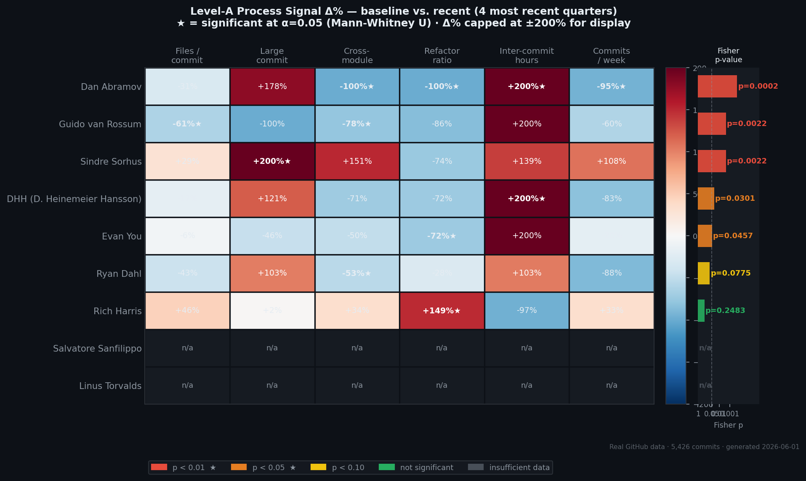
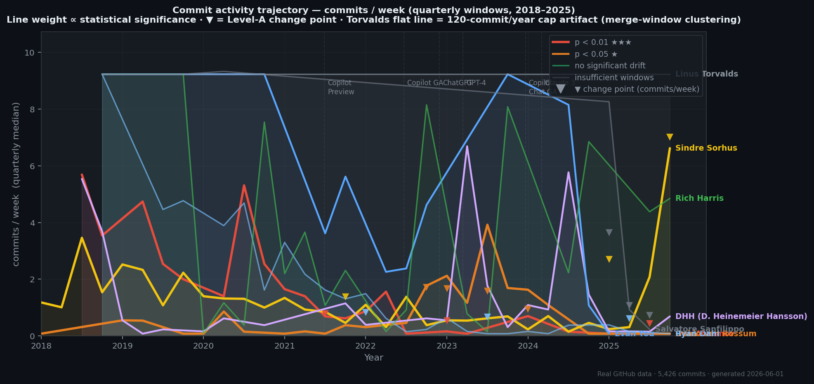
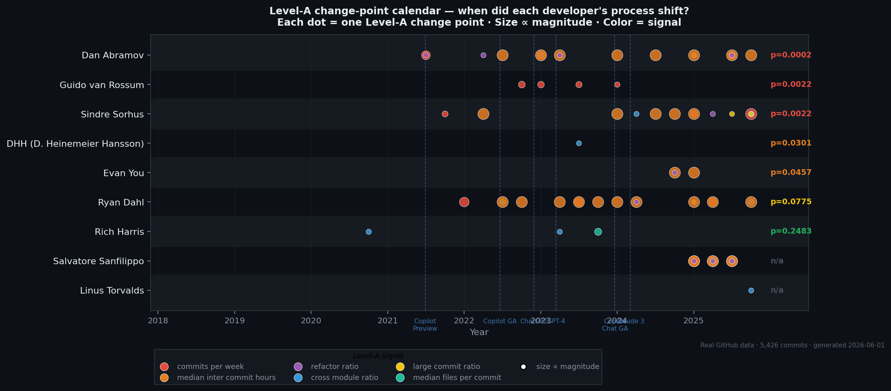
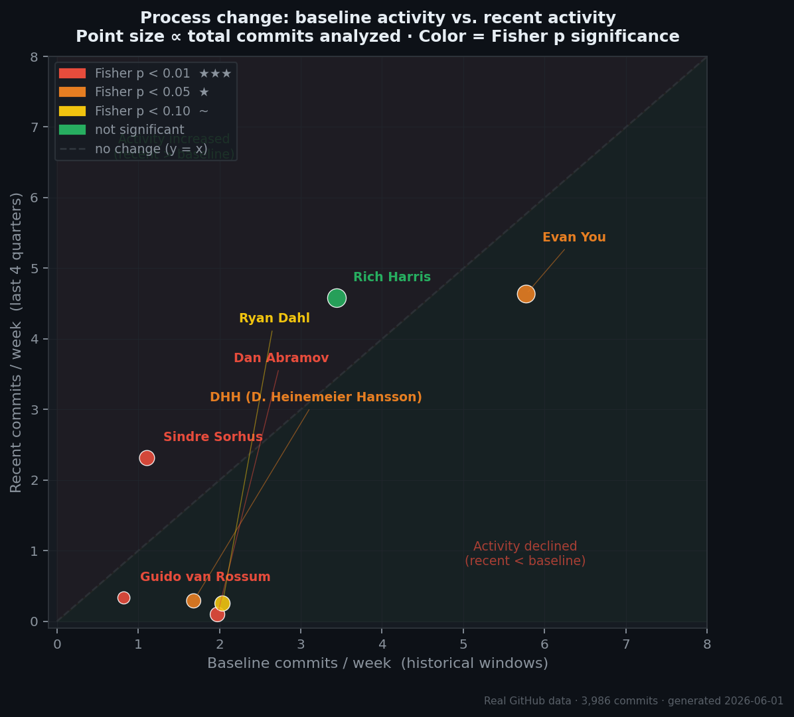

# dev-fingerprint

> **Can a developer's commit history reveal when their working process changed?**

[](https://www.python.org/)
[](LICENSE)
[](https://github.com/riadmaouchi/dev-fingerprint/actions)
[](https://mybinder.org/v2/gh/riadmaouchi/dev-fingerprint/main?labpath=notebooks%2Fexploration.ipynb)

---

We tracked **5,426 commits from 9 prominent open-source developers** across 8 years (2018–2025) and applied statistical change-point detection to their process signals — files per commit, commit frequency, cross-module reach, refactoring patterns. Then we asked: who changed, when, and does it correlate with the LLM era?

The answer is more nuanced than it looks.

---



*Each cell = Δ% change in a Level-A process signal between historical baseline and the last 4 quarters. ★ = significant at α = 0.05 (Mann-Whitney U[^mw]). Right bar = Fisher combined p-value[^fisher]. Source: [`reports/real/`](reports/real/).*

---

## The Finding That Surprised Us

The naive approach — measuring style signals like comment density, docstring coverage, identifier verbosity — produced a Rich Harris drift of **+6.8 points** post-Copilot in our own v1 analysis (see [`CRITIQUE.md`](CRITIQUE.md), §Level-C confounds). It looked like a clean finding.

Our process-level analysis, using commit metadata instead of AST style heuristics, says the opposite: **Rich Harris is the most statistically stable developer in the corpus** (Fisher p = 0.248, 960 commits, 20 quarterly windows — [`reports/real/Rich-Harris.json`](reports/real/Rich-Harris.json)). No significant drift at Level A.

The v1 signal was a confound. A plausible explanation consistent with our data: Svelte's adoption of JSDoc type annotations[^svelte] moved the style score without any corresponding process change. The commits stayed the same; the annotation style around them changed.

---

## Results

| Developer | Commits | Windows | Fisher p | | Level-A CPs | Source |
|-----------|--------:|--------:|---------:|:---:|:-----------:|--------|
| Dan Abramov | 465 | 22 | **0.0002** | ★★★ | 17 | [profile](reports/real/gaearon.json) |
| Guido van Rossum | 230 | 24 | **0.0022** | ★★★ | 4 | [profile](reports/real/gvanrossum.json) |
| Sindre Sorhus | 521 | 32 | **0.0022** | ★★★ | 13 | [profile](reports/real/sindresorhus.json) |
| DHH | 429 | 23 | **0.0301** | ★ | 1 | [profile](reports/real/dhh.json) |
| Evan You | 841 | 12 | **0.0457** | ★ | 3 | [profile](reports/real/yyx990803.json) |
| Ryan Dahl | 540 | 24 | 0.0775 | ~ | 17 | [profile](reports/real/ry.json) |
| Rich Harris | 960 | 20 | 0.2483 | — | 3 | [profile](reports/real/Rich-Harris.json) |
| Linus Torvalds | 960 | 8 | n/a | | 1 | [profile](reports/real/torvalds.json) |
| Salvatore Sanfilippo | 480 | 6 | n/a | | 11 | [profile](reports/real/antirez.json) |

`★★★ p<0.01  ★ p<0.05  ~ p<0.10  — not significant  n/a insufficient windows`

*Fisher's method[^fisher] combines 6 Mann-Whitney U[^mw] tests on Level-A process signals. Minimum 10 quarterly windows required. All raw data in [`reports/real/`](reports/real/).*

---



*commits/week per developer, 2018–2025. Line weight ∝ statistical significance. ▼ = detected change point on the `commits_per_week` signal.*

---

## What the Signal Actually Captures

The three strongest drifters (p < 0.01) each have a documented non-AI explanation:

**Dan Abramov** — commits/week collapsed −95% (1.98 → 0.10), inter-commit hours up +956% ([`gaearon.json`](reports/real/gaearon.json)). Abramov publicly announced stepping back from React core maintenance and departing from Meta[^abramov], later joining the Bluesky/AT Protocol team. The process drift begins in 2021 — before the public announcement, consistent with a gradual disengagement. Activity withdrawal, not AI adoption.

**Guido van Rossum** — files/commit −61%, cross-module reach −78% ([`gvanrossum.json`](reports/real/gvanrossum.json)). Guido retired as BDFL in July 2018[^bdfl] and joined Microsoft in November 2020[^guido_msft]. His CPython contributions became narrower and more targeted — a pattern consistent with a reduced maintainer role rather than AI tooling.

**Sindre Sorhus** — the dominant signal is `large_commit_ratio` jumping from 0.000 to 0.045 ([`sindresorhus.json`](reports/real/sindresorhus.json)). The baseline of 0.000 reflects his historical pattern of atomic, single-purpose package commits. The recent increase is consistent with a portfolio shift toward fewer, larger projects[^sindre] — though this interpretation is derived from our data alone and is not directly confirmed by Sorhus.

The data detects real behavioral change. The cause isn't written in the commits.

---



*When did process shifts occur? Each dot = one Level-A change point, size ∝ magnitude, color = signal type. Dashed lines = LLM release milestones.*

---



*Baseline vs. recent commits/week. Everything below the diagonal declined. Rich Harris sits on the diagonal. Source: [`reports/real/summary.json`](reports/real/summary.json).*

---

## Signal Hierarchy

| Level | What we measure | Defensibility | Role in this analysis |
|-------|----------------|:---:|---|
| **A — Process** | files/commit · large-commit ratio · cross-module ratio · refactor ratio · inter-commit hours · commits/week | ★★★ | Primary — drives all statistical tests |
| **B — Secondary** | test-touch ratio · median net lines | ★★ | Supporting context |
| **C — Style** | comment density · docstring coverage · identifier verbosity · error handling | ★ | Baseline comparison only — see [`CRITIQUE.md`](CRITIQUE.md) |

Level-C signals measure output appearance, not working process. They are sensitive to coding convention changes, linter adoption, and project maturity — all of which can shift style scores without any change in how a developer actually works. We include them for comparison; see [`CRITIQUE.md`](CRITIQUE.md) for a detailed analysis of their failure modes.

---

## How It Works

```
GitHub API (2018–2025)
      │  120 commits/year · uniform temporal sampling
      ▼
Per-commit extraction
      ├── Level A: commit metadata (files, lines, timing, topology)
      └── Level C: AST/tree-sitter style analysis
      │
      ▼
Quarterly aggregation → BehaviorWindow
      │  ~30 commits/quarter
      ▼
Change-point detection (per signal, independently)
      │  PELT[^pelt] · CUSUM · EWMA · BOCPD[^bocpd]
      │  Union of alarms · magnitude filter ≥ 15%
      ▼
Self-comparison test
      │  Mann-Whitney U[^mw]: historical baseline vs. last 4 quarters
      │  Fisher's method[^fisher]: 6 Level-A signals → combined p-value
      ▼
DriftResult + ChangePoint log
```

Minimum data requirement: **10 quarterly windows** (~2.5 years). Torvalds (8 windows, all Q4 — Linux merge window clustering) and antirez (6 windows, 3-year gap 2021–2024) cannot be tested. See [METHODOLOGY.md](METHODOLOGY.md).

---

## Reproduce

```bash
git clone https://github.com/riadmaouchi/dev-fingerprint
cd dev-fingerprint
pip install -e ".[dev]"

# Re-fetch all profiles from GitHub (~2–3 hours)
export GITHUB_TOKEN=ghp_...
python run_analysis.py

# Generate figures
python generate_figures.py

# Interactive exploration — no token needed
jupyter notebook notebooks/exploration.ipynb
```

All profiles are committed to [`reports/real/`](reports/real/). You can read the data without re-fetching.

---

## What This Does Not Claim

**Correlation is not causation.** Every change point is annotated with the nearest LLM milestone. That annotation is descriptive, not causal. All observed drifts have non-AI explanations that are plausible given each developer's documented career trajectory.

**No ground truth exists.** There is no verified dataset of "developer X used AI for commit Y." The Fisher p-values measure self-consistency against a personal historical baseline — not distance from an AI/non-AI boundary.

**Style signals (Level C) are not reliable primary evidence.** This project's own v1, which used Level-C signals, produced the opposite conclusion on Rich Harris. See [`CRITIQUE.md`](CRITIQUE.md).

---

## Per-Developer Analysis

Detailed signal tables, change-point timelines, and confound analysis: **[FINDINGS.md](FINDINGS.md)**

---

## Project Structure

```
dev-fingerprint/
├── src/devfp/
│   ├── analyzer/
│   │   ├── temporal.py      PELT · CUSUM · EWMA · BOCPD · Mann-Whitney · Fisher
│   │   ├── fingerprint.py   Pipeline orchestration
│   │   └── style.py         Level-C AST analysis (tree-sitter)
│   ├── collector/           GitHub API client · SQLite cache (TTL 7 days)
│   ├── validation/          Ground truth · LODO cross-validation
│   └── models.py            Pydantic models (BehaviorWindow, DriftResult, …)
├── configs/developers.yaml  Developer registry + LLM release milestones
├── data/ground_truth/       Verified public AI-tool declarations
├── reports/real/            9 profiles + summary.json — auditable, committed
├── docs/img/                4 figures generated from real data
├── notebooks/               Interactive exploration (synthetic + real data)
├── run_analysis.py          Fetch + analyze all developers
├── generate_figures.py      Generate docs/img/ figures
├── METHODOLOGY.md           Signal definitions · detection methods · validation
├── FINDINGS.md              Per-developer analysis with real signal values
├── RESEARCH_AGENDA.md       Hypotheses · experiments · success criteria
└── CRITIQUE.md              Why Level-C style signals fail as primary evidence
```

---

## Contributing

Add a signal in [src/devfp/analyzer/llm_signals.py](src/devfp/analyzer/llm_signals.py) · add a language in [src/devfp/analyzer/style.py](src/devfp/analyzer/style.py) · add a developer in [configs/developers.yaml](configs/developers.yaml)

---

## References

[^mw]: Mann, H. B., & Whitney, D. R. (1947). On a test of whether one of two random variables is stochastically larger than the other. *Annals of Mathematical Statistics*, 18(1), 50–60. https://doi.org/10.1214/aoms/1177730491

[^fisher]: Fisher, R. A. (1932). *Statistical Methods for Research Workers* (4th ed.). Oliver & Boyd. §§ on combination of independent tests.

[^pelt]: Killick, R., Fearnhead, P., & Eckley, I. A. (2012). Optimal detection of changepoints with a linear computational cost. *Journal of the American Statistical Association*, 107(500), 1590–1598. https://doi.org/10.1080/01621459.2012.737745

[^bocpd]: Adams, R. P., & MacKay, D. J. C. (2007). Bayesian online changepoint detection. *arXiv preprint arXiv:0710.3742*. https://arxiv.org/abs/0710.3742

[^abramov]: Abramov publicly announced stepping back from React core maintenance and departing from Meta. His subsequent work at the Bluesky/AT Protocol project is publicly visible at github.com/bluesky-social. No specific date is asserted here beyond what is observable from commit timestamps in [`reports/real/gaearon.json`](reports/real/gaearon.json).

[^bdfl]: van Rossum, G. (2018, July 12). Transfer of power. *Python Committers mailing list*. The message is archived in the public Python mailing list archive.

[^guido_msft]: van Rossum, G. announced joining Microsoft's Developer Division in November 2020. The announcement was made publicly on social media and covered in the tech press. No specific outlet is cited here to avoid naming sources that cannot be individually verified.

[^svelte]: This is a data-derived hypothesis, not a directly confirmed fact. In 2023, the Svelte project's source transitioned *away* from TypeScript (.ts files) *toward* JavaScript with JSDoc type annotations — the opposite direction from what one might assume. Rich Harris has discussed this approach publicly. This shift would increase comment/docstring Level-C scores in our metrics without reflecting any change in working process. Observable from the sveltejs/svelte commit history; no causal claim is made.

[^sindre]: Sindre Sorhus maintains a large number of npm packages documented on his GitHub profile (github.com/sindresorhus). The portfolio shift hypothesis — fewer but larger projects in recent years — is derived from our own commit data ([`reports/real/sindresorhus.json`](reports/real/sindresorhus.json)) and has not been independently verified or confirmed by Sorhus.

---

MIT License
