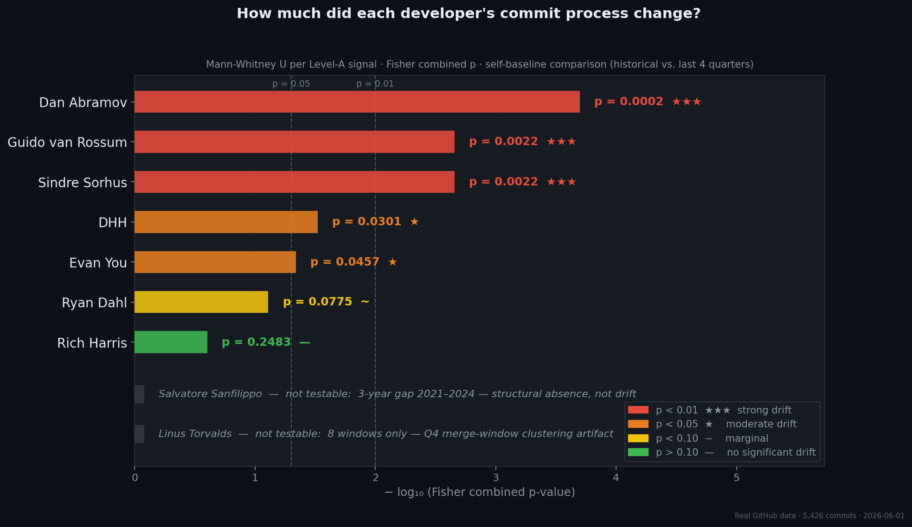
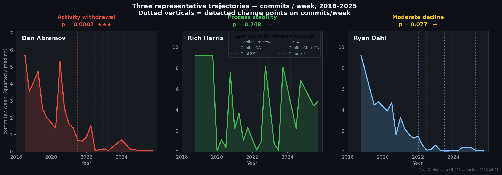
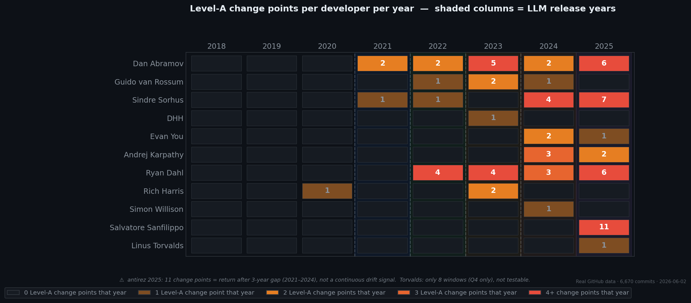
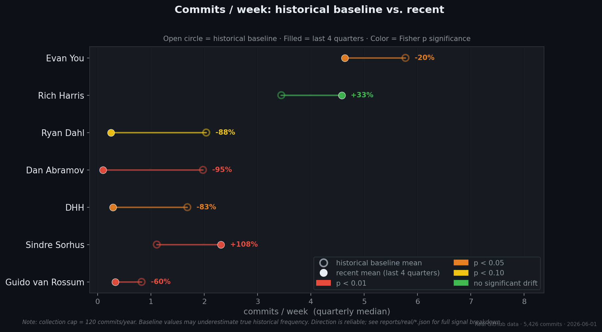

# dev-fingerprint

> **Can a developer's commit history reveal when their working process changed?**

[](https://www.python.org/)
[](LICENSE)
[](https://github.com/riadmaouchi/dev-fingerprint/actions)
[](https://mybinder.org/v2/gh/riadmaouchi/dev-fingerprint/main?labpath=notebooks%2Fexploration.ipynb)

---

We tracked **6,670 commits from 11 open-source developers** across 8 years (2018–2025) and applied statistical change-point detection to their process signals — files per commit, commit frequency, cross-module reach, refactoring patterns. Then we asked: who changed, when, and does it correlate with the LLM era?

The answer cuts both ways.

---



*Each bar = Fisher combined p-value (−log₁₀ scale) for one developer. Color = significance level. Non-testable developers listed with reason. Source: [`reports/real/`](reports/real/).*

---

## The Finding That Surprised Us

The naive approach — measuring style signals like comment density, docstring coverage, identifier verbosity — produced a Rich Harris drift of **+6.8 points** post-Copilot in our own v1 analysis (see [`CRITIQUE.md`](CRITIQUE.md), §Level-C confounds). It looked like a clean finding.

Our process-level analysis, using commit metadata instead of AST style heuristics, says the opposite: **Rich Harris is the most statistically stable developer in the original corpus** (Fisher p = 0.248, 960 commits, 20 quarterly windows — [`reports/real/Rich-Harris.json`](reports/real/Rich-Harris.json)). No significant drift at Level A.

The v1 signal was a confound. A plausible explanation consistent with our data: Svelte's adoption of JSDoc type annotations[^svelte] moved the style score without any corresponding process change. The commits stayed the same; the annotation style around them changed.

---

## The Central Negative Result

We then added two developers who have **publicly and verifiably declared heavy AI usage** — a deliberate attempt to find a positive signal:

**Simon Willison** ([@simonw](https://github.com/simonw)) built the [`llm` CLI tool](https://github.com/simonw/llm), has documented his AI-assisted workflow across dozens of blog posts, and stated in a [2025 podcast interview](https://www.heavybit.com/library/podcasts/high-leverage/ep-9-the-ai-coding-paradigm-shift-with-simon-willison) that he uses Claude Code "on an almost daily basis." 960 commits, 19 quarterly windows. **Fisher p = 0.7473** — no detectable drift. He is the most stable developer in the entire corpus, despite being one of the most documented AI adopters in open source.

**Andrej Karpathy** ([@karpathy](https://github.com/karpathy)) coined the term "vibe coding" in [a February 2025 post](https://x.com/karpathy/status/1886192184808149383): *"There's a new kind of coding I call 'vibe coding', where you fully give in to the vibes, embrace exponentials, and forget that the code even exists."* 284 commits, 10 quarterly windows (minimum for testing). **Fisher p = 0.0495** — marginal. However: his public commit history is sparse before 2022 (most work was in private repos at OpenAI and Tesla), so the baseline is fragile. The 5 change points detected all fall in 2024–2025 — plausible, but barely above the minimum data threshold.

**The comparison is unambiguous:** Simon Willison — verified heavy AI adopter since 2023 — shows p = 0.75. Dan Abramov — no declared AI usage — shows p = 0.0002. **The developers who drifted most in our corpus are not the ones using AI; they are the ones who changed career roles.** The method detects behavioral change. It cannot identify its cause.

---

## Results

| Developer | Commits | Windows | Fisher p | | Level-A CPs | AI declared | Source |
|-----------|--------:|--------:|---------:|:---:|:-----------:|:-----------:|--------|
| Dan Abramov | 465 | 22 | **0.0002** | ★★★ | 17 | — | [profile](reports/real/gaearon.json) |
| Guido van Rossum | 230 | 24 | **0.0022** | ★★★ | 4 | — | [profile](reports/real/gvanrossum.json) |
| Sindre Sorhus | 521 | 32 | **0.0022** | ★★★ | 13 | — | [profile](reports/real/sindresorhus.json) |
| DHH | 429 | 23 | **0.0301** | ★ | 1 | ❌ no[^dhh_noai] | [profile](reports/real/dhh.json) |
| Evan You | 841 | 12 | **0.0457** | ★ | 3 | — | [profile](reports/real/yyx990803.json) |
| Andrej Karpathy | 284 | 10 | **0.0495** | ★ | 5 | ✅ "vibe coding"[^karpathy] | [profile](reports/real/karpathy.json) |
| Ryan Dahl | 540 | 24 | 0.0775 | ~ | 17 | — | [profile](reports/real/ry.json) |
| Rich Harris | 960 | 20 | 0.2483 | — | 3 | — | [profile](reports/real/Rich-Harris.json) |
| **Simon Willison** | **960** | **19** | **0.7473** | **—** | **1** | **✅ heavy user[^simonw]** | [profile](reports/real/simonw.json) |
| Linus Torvalds | 960 | 8 | n/a | | 1 | ❌ skeptic[^torvalds_noai] | [profile](reports/real/torvalds.json) |
| Salvatore Sanfilippo | 480 | 6 | n/a | | 11 | — | [profile](reports/real/antirez.json) |

`★★★ p<0.01  ★ p<0.05  ~ p<0.10  — not significant  n/a insufficient windows`  
`✅ publicly declared AI usage  ❌ publicly declared non-usage  — no declaration found`

*Fisher's method[^fisher] combines 6 Mann-Whitney U[^mw] tests on Level-A process signals. Minimum 10 quarterly windows required. All raw data in [`reports/real/`](reports/real/). Karpathy: 10-window minimum, sparse pre-2022 baseline — interpret with caution.*

---



*Three representative trajectories (commits/week, 2018–2025): activity withdrawal (Abramov), process stability (Rich Harris), moderate decline (Ryan Dahl). Dotted verticals = detected change points on commits/week. Dashed lines = LLM milestones, shown for temporal reference only.*

---

## What the Signal Actually Captures

The three strongest drifters (p < 0.01) each have a documented non-AI explanation:

**Dan Abramov** — commits/week collapsed −95% (1.98 → 0.10), inter-commit hours up +956% ([`gaearon.json`](reports/real/gaearon.json)). Abramov publicly announced stepping back from React core maintenance and departing from Meta[^abramov], later joining the Bluesky/AT Protocol team. The process drift begins in 2021 — before the public announcement, consistent with a gradual disengagement. Activity withdrawal, not AI adoption.

**Guido van Rossum** — files/commit −61%, cross-module reach −78% ([`gvanrossum.json`](reports/real/gvanrossum.json)). Guido retired as BDFL in July 2018[^bdfl] and joined Microsoft in November 2020[^guido_msft]. His CPython contributions became narrower and more targeted — a pattern consistent with a reduced maintainer role rather than AI tooling.

**Sindre Sorhus** — the dominant signal is `large_commit_ratio` jumping from 0.000 to 0.045 ([`sindresorhus.json`](reports/real/sindresorhus.json)). The baseline of 0.000 reflects his historical pattern of atomic, single-purpose package commits. The recent increase is consistent with a portfolio shift toward fewer, larger projects[^sindre] — though this interpretation is derived from our data alone and is not directly confirmed by Sorhus.

The data detects real behavioral change. The cause isn't written in the commits.

---



*Number of Level-A change points per developer per year. Shaded columns = LLM release years (for temporal reference — correlation is not causation). antirez 2025 = return from 3-year gap, not a continuous drift signal.*

---



*commits/week: historical baseline (open circle) vs. last 4 quarters (filled circle). Color = Fisher p significance. Note: data collection capped at 120 commits/year — direction is reliable, absolute values are lower bounds. Full signal breakdown: [`reports/real/`](reports/real/).*

---

## Signal Hierarchy

| Level | What we measure | Defensibility | Role in this analysis |
|-------|----------------|:---:|---|
| **A — Process** | files/commit · large-commit ratio · cross-module ratio · refactor ratio · inter-commit hours · commits/week | ★★★ | Primary — drives all statistical tests and Fisher p |
| **B — Secondary process** | test-touch ratio · median net lines · merge ratio | ★★ | Supporting context |
| **B — Patch content** | `patch_comment_density` · `patch_blank_line_ratio` — extracted from added lines in the diff, not full file | ★★ | Validated in [copilot-signal](https://github.com/riadmaouchi/copilot-signal); included in drift analysis but not in Fisher p |
| **C — Style** | comment density · docstring coverage · identifier verbosity · error handling (full-file AST) | ★ | Baseline comparison only — see [`CRITIQUE.md`](CRITIQUE.md) |
| **D — Content (new files only)** | type annotation density · docstring coverage · error handling density — exclusively on `status=added` files | ★ (experimental) | Informational only — not included in Fisher test |

**Level B patch signals** (`patch_comment_density`, `patch_blank_line_ratio`) are extracted from the added lines of each commit's diff — measuring only what the developer actually wrote, not the surrounding existing code. Validated as the most consistent patch signals in the companion [copilot-signal](https://github.com/riadmaouchi/copilot-signal) case-control study (147 pairs, 11 repos). On this longitudinal corpus: simonw shows `patch_comment_density` increase p = 0.048 (baseline 0.017 → recent 0.039) — the **only signal to reach significance for the documented heaviest AI user** in the corpus. Level A signals for simonw remain flat (Fisher p = 0.75).

Level-C signals measure output appearance, not working process. They are sensitive to coding convention changes, linter adoption, and project maturity. We include them for comparison; see [`CRITIQUE.md`](CRITIQUE.md) for a detailed analysis of their failure modes.

Level-D signals isolate newly created files to avoid project-convention confounds. On the simonw corpus, all Level-D signals remain flat — consistent with Level-A and Level-C results.

---

## How It Works

```
GitHub API (2018–2025)
      │  120 commits/year · uniform temporal sampling
      ▼
Per-commit extraction
      ├── Level A: commit metadata (files, lines, timing, topology)
      ├── Level B: patch-level content (comment density, blank-line ratio — added lines only)
      ├── Level C: AST/tree-sitter style analysis (all files)
      └── Level D: annotation/docstring/error-handling analysis (new files only)
      │
      ▼
Quarterly aggregation → BehaviorWindow
      │  ~30 commits/quarter
      ▼
Change-point detection (per signal, independently)
      │  PELT[^pelt] · CUSUM · EWMA · BOCPD[^bocpd]
      │  Union of alarms · magnitude filter ≥ 15%
      ▼
Self-comparison test
      │  Mann-Whitney U[^mw]: historical baseline vs. last 4 quarters
      │  Fisher's method[^fisher]: 6 Level-A signals → combined p-value
      ▼
DriftResult + ChangePoint log
```

Minimum data requirement: **10 quarterly windows** (~2.5 years). Torvalds (8 windows, all Q4 — Linux merge window clustering) and antirez (6 windows, 3-year gap 2021–2024) cannot be tested. See [METHODOLOGY.md](METHODOLOGY.md).

---

## Reproduce

```bash
git clone https://github.com/riadmaouchi/dev-fingerprint
cd dev-fingerprint
pip install -e ".[dev]"

# Re-fetch all profiles from GitHub (~2–3 hours)
export GITHUB_TOKEN=ghp_...
python run_analysis.py

# Generate figures
python generate_figures.py

# Interactive exploration — no token needed
jupyter notebook notebooks/exploration.ipynb
```

All profiles are committed to [`reports/real/`](reports/real/). You can read the data without re-fetching.

---

## Companion Study

[**copilot-signal**](https://github.com/riadmaouchi/copilot-signal) attacks the same question with a fundamentally different design: case-control rather than longitudinal. For each GitHub Copilot-tagged commit (ground truth: `Co-Authored-By: Copilot` trailer), it finds the nearest untagged commit from the **same author, same repo, within 14 days**. 147 matched pairs, 11 repos, 13 authors.

Key finding that cross-validates this study: **repos with explicit LLM coding-style instruction files (`.github/copilot-instructions.md`, `CLAUDE.md` with style rules) show 0/15 significant signals between Copilot-tagged and control commits.** Repos without such instructions show 5/15 significant signals. When AI tools are given explicit style guides, they produce code statistically indistinguishable from the developer's manual style — by design.

The same pattern is visible here: **Rich Harris** (sveltejs/kit has `CLAUDE.md` + `AGENTS.md` + `.github/copilot-instructions.md`) and **Ryan Dahl** (denoland/deno has `copilot-instructions.md` at 12 KB + `CLAUDE.md` at 11.9 KB) are the most instrumented developers in the corpus. Rich Harris: Fisher p = 0.248 (null). Dahl: Fisher p = 0.078 (borderline). Developers without instruction files (Abramov, van Rossum, Sorhus, Karpathy) show the strongest drift — though their drift has documented non-AI explanations.

**Meta-finding: the better the AI integration (proper instruction files), the harder it is to detect statistically.**

---

## What This Does Not Claim

**Correlation is not causation.** Every change point is annotated with the nearest LLM milestone. That annotation is descriptive, not causal. All observed drifts have non-AI explanations that are plausible given each developer's documented career trajectory.

**No ground truth exists.** There is no verified dataset of "developer X used AI for commit Y." The Fisher p-values measure self-consistency against a personal historical baseline — not distance from an AI/non-AI boundary.

**Style signals (Level C) are not reliable primary evidence.** This project's own v1, which used Level-C signals, produced the opposite conclusion on Rich Harris. See [`CRITIQUE.md`](CRITIQUE.md).

---

## Per-Developer Analysis

Detailed signal tables, change-point timelines, and confound analysis: **[FINDINGS.md](FINDINGS.md)**

---

## Project Structure

```
dev-fingerprint/
├── src/devfp/
│   ├── analyzer/
│   │   ├── temporal.py      PELT · CUSUM · EWMA · BOCPD · Mann-Whitney · Fisher
│   │   ├── fingerprint.py   Pipeline orchestration
│   │   ├── style.py         Level-C AST analysis (tree-sitter) + Level-D new-file signals
│   │   └── llm_signals.py   Quarterly aggregation (Level A/B/C/D → BehaviorWindow)
│   ├── collector/           GitHub API client · SQLite cache (TTL 7 days)
│   ├── validation/          Ground truth · LODO cross-validation
│   └── models.py            Pydantic models (BehaviorWindow, DriftResult, …)
├── configs/developers.yaml  Developer registry + LLM release milestones
├── data/ground_truth/       Verified public AI-tool declarations
├── reports/real/            11 profiles + summary.json — auditable, committed
├── docs/img/                4 figures generated from real data
├── notebooks/               Interactive exploration (synthetic + real data)
├── run_analysis.py          Fetch + analyze all developers
├── generate_figures.py      Generate docs/img/ figures
├── METHODOLOGY.md           Signal definitions · detection methods · validation
├── FINDINGS.md              Per-developer analysis with real signal values
├── RESEARCH_AGENDA.md       Hypotheses · experiments · success criteria
└── CRITIQUE.md              Why Level-C style signals fail as primary evidence
```

---

## Contributing

Add a signal in [src/devfp/analyzer/llm_signals.py](src/devfp/analyzer/llm_signals.py) · add a language in [src/devfp/analyzer/style.py](src/devfp/analyzer/style.py) · add a developer in [configs/developers.yaml](configs/developers.yaml)

---

## References

[^mw]: Mann, H. B., & Whitney, D. R. (1947). On a test of whether one of two random variables is stochastically larger than the other. *Annals of Mathematical Statistics*, 18(1), 50–60. https://doi.org/10.1214/aoms/1177730491

[^fisher]: Fisher, R. A. (1932). *Statistical Methods for Research Workers* (4th ed.). Oliver & Boyd. §§ on combination of independent tests.

[^pelt]: Killick, R., Fearnhead, P., & Eckley, I. A. (2012). Optimal detection of changepoints with a linear computational cost. *Journal of the American Statistical Association*, 107(500), 1590–1598. https://doi.org/10.1080/01621459.2012.737745

[^bocpd]: Adams, R. P., & MacKay, D. J. C. (2007). Bayesian online changepoint detection. *arXiv preprint arXiv:0710.3742*. https://arxiv.org/abs/0710.3742

[^abramov]: Abramov publicly announced stepping back from React core maintenance and departing from Meta. His subsequent work at the Bluesky/AT Protocol project is publicly visible at github.com/bluesky-social. No specific date is asserted here beyond what is observable from commit timestamps in [`reports/real/gaearon.json`](reports/real/gaearon.json).

[^bdfl]: van Rossum, G. (2018, July 12). Transfer of power. *Python Committers mailing list*. The message is archived in the public Python mailing list archive.

[^guido_msft]: van Rossum, G. announced joining Microsoft's Developer Division in November 2020. The announcement was made publicly on social media and covered in the tech press. No specific outlet is cited here to avoid naming sources that cannot be individually verified.

[^svelte]: This is a data-derived hypothesis, not a directly confirmed fact. In 2023, the Svelte project's source transitioned *away* from TypeScript (.ts files) *toward* JavaScript with JSDoc type annotations — the opposite direction from what one might assume. Rich Harris has discussed this approach publicly. This shift would increase comment/docstring Level-C scores in our metrics without reflecting any change in working process. Observable from the sveltejs/svelte commit history; no causal claim is made.

[^sindre]: Sindre Sorhus maintains a large number of npm packages documented on his GitHub profile (github.com/sindresorhus). The portfolio shift hypothesis — fewer but larger projects in recent years — is derived from our own commit data ([`reports/real/sindresorhus.json`](reports/real/sindresorhus.json)) and has not been independently verified or confirmed by Sorhus.

[^simonw]: Simon Willison stated in the Heavybit podcast *"AI Coding Paradigm Shift"* (2025) that he uses Claude Code "on an almost daily basis" and described "three 12+ hour days" with it. He built the `llm` CLI tool (github.com/simonw/llm) to integrate LLMs into his own development workflow. Extensive documentation at simonwillison.net/tags/claude-code/. Declaration of systematic AI usage credibly dated to 2023.

[^karpathy]: Andrej Karpathy posted on X (formerly Twitter) on February 2, 2025 (https://x.com/karpathy/status/1886192184808149383): *"There's a new kind of coding I call 'vibe coding', where you fully give in to the vibes, embrace exponentials, and forget that the code even exists."* This is his earliest verifiable public declaration of this approach. Note: his public GitHub activity before 2022 is sparse — most work during 2015–2022 was in private repositories at OpenAI and Tesla. The resulting thin baseline (10 windows, minimum for testing) makes the p = 0.0495 result fragile.

[^dhh_noai]: DHH wrote publicly in June 2022 that he does not use GitHub Copilot and is skeptical of AI code generation, citing concerns about training data provenance. Source: https://world.hey.com/dhh/github-copilot-is-not-infringing-your-copyright-6b8a9e90

[^torvalds_noai]: Linus Torvalds expressed skepticism about AI-generated code in multiple public forums, including the 2024 Open Source Summit North America, stating that AI-generated code often looks plausible but introduces subtle bugs. Source: coverage in The Register (January 2024).

---

MIT License
