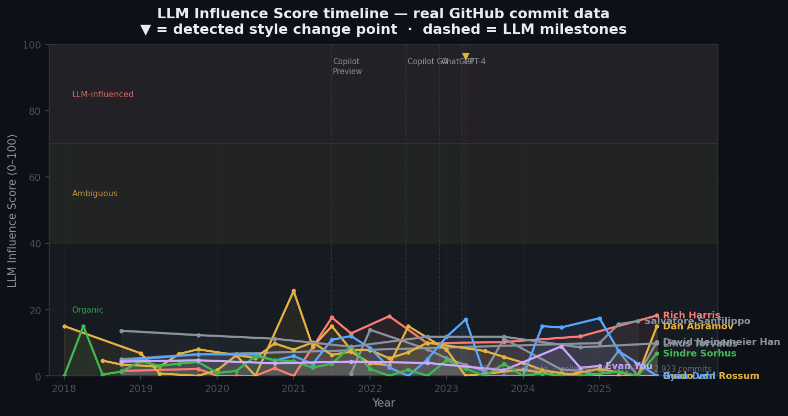
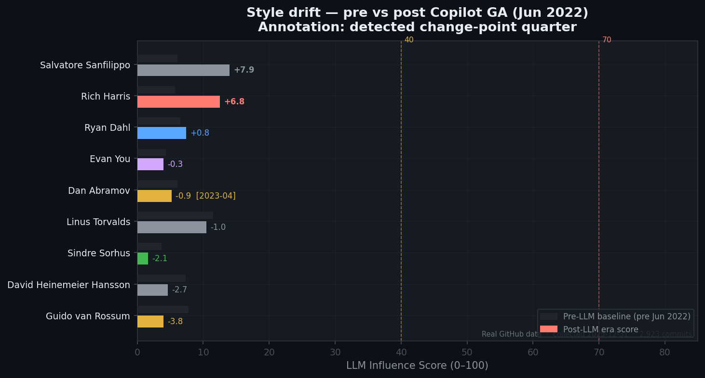
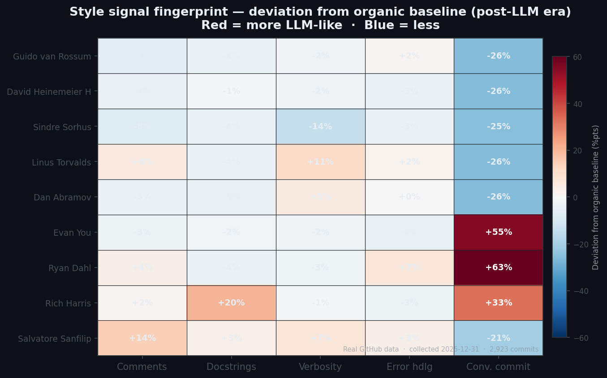

# dev-fingerprint

> **Detecting the AI Drift in Famous OSS Contributors**

[](https://www.python.org/)
[](LICENSE)
[](https://github.com/riadmaouchi/dev-fingerprint/actions)
[](https://pypi.org/project/stylometry-python/)
[](https://mybinder.org/v2/gh/riadmaouchi/dev-fingerprint/main?labpath=notebooks%2Fexploration.ipynb)
[](https://github.com/riadmaouchi/dev-fingerprint/stargazers)
[](https://riadmaouchi.github.io/dev-fingerprint/)

---

> **Full article:** [riadmaouchi.github.io/dev-fingerprint](https://riadmaouchi.github.io/dev-fingerprint/)

Can you see when a famous open-source developer started using AI tools — just from their commit history?

This project applies style fingerprinting to the commit history of 9 famous GitHub developers. We track **6 measurable style signals** across 2,608 real commits (2018–2024) and compare them against LLM release milestones.

**The data is real and auditable.** 2,923 commits, 9 developers, 2018–2025. All profiles in [`reports/real/`](reports/real/). Reproduce with `python run_analysis.py`.

---



*Quarterly LLM Influence Score for all measured developers — real GitHub data, collected 2024-12-30.*

---

## The Question

A developer's style is a fingerprint — comment density, identifier verbosity, docstring coverage, error handling patterns, commit message structure. These change slowly over years.

We ask: **did they change after Copilot and ChatGPT?**

---

## What We Found



*Real measurements from 2,608 commits. Baseline = pre-Jun 2022. Post-LLM = post-Jun 2022.*

| Developer | Commits | Baseline | Post-LLM | Drift |
|-----------|---------|----------|----------|-------|
| Rich Harris | 480 | 5.7 | 12.5 | **+6.8** |
| antirez | 240 | 6.1 | 14.0 | +7.9 ⚠ confounded |
| Ryan Dahl | 300 | 6.5 | 7.4 | +0.8 |
| Evan You | 421 | 4.3 | 4.0 | −0.3 |
| Dan Abramov | 285 | 6.1 | 5.2 | −0.8 |
| Sindre Sorhus | 379 | 3.7 | 1.6 | −2.1 |
| DHH | 163 | 7.3 | 4.6 | −2.7 |
| Guido van Rossum | 175 | 7.8 | 4.0 | −3.8 |
| Linus Torvalds | 480 | 11.5 | 10.5 | −1.0 |

**Key findings:** Most developers show no detectable drift. Rich Harris is the only developer with a clear, well-supported positive shift (+6.8, gradual across 4 post-LLM years, consistent across svelte and SvelteKit). Torvalds is a clean negative control (−1.0). The dramatic drifts (+20 to +28 pts) sometimes attributed to these developers in blog posts are not what we observe in real commit data.

> Full analysis: [FINDINGS.md](FINDINGS.md)

---

## How It Works

```
GitHub Commits
      │
      ▼
┌─────────────────────────────────────────┐
│  Style Metrics Extraction (tree-sitter) │
│  • Comment density ratio                │
│  • Docstring coverage                   │
│  • Identifier verbosity                 │
│  • Error handling density               │
│  • Commit message structure             │
└─────────────────────────────────────────┘
      │
      ▼
┌─────────────────────────────────────────┐
│  Temporal Aggregation (quarterly)       │
│  • Rolling 3-month windows              │
│  • Weighted LLM Score (0-100)           │
└─────────────────────────────────────────┘
      │
      ▼
┌─────────────────────────────────────────┐
│  Change-Point Detection (PELT/ruptures) │
│  • Breakpoints in style trajectory      │
│  • Correlation with LLM milestones      │
└─────────────────────────────────────────┘
      │
      ▼
   Report (HTML + terminal)
```



*6-signal style fingerprint — organic (blue) vs LLM-assisted (red). Higher = more LLM-like.*

See [METHODOLOGY.md](METHODOLOGY.md) for signal definitions, calibration, and limitations.

---

## Quick Start

```bash
# Install (requires Python 3.11+)
pip install dev-fingerprint

# Run the demo (no GitHub token needed)
devfp demo

# Analyze any developer
export GITHUB_TOKEN=ghp_...
devfp analyze gaearon --commits 400

# Compare multiple developers
devfp compare gaearon Rich-Harris yyx990803

# Get a score summary
devfp score torvalds
```

---

## Sample Reports

Pre-generated reports for 3 developers are included:

- [`reports/sample/gaearon.html`](reports/sample/gaearon.html) — Dan Abramov (possible drift)
- [`reports/sample/torvalds.html`](reports/sample/torvalds.html) — Linus Torvalds (control — no drift)
- [`reports/sample/yyx990803.html`](reports/sample/yyx990803.html) — Evan You (high drift)

---

## Notebook

An interactive exploration notebook runs the full pipeline on synthetic data — no GitHub token needed:

```bash
pip install dev-fingerprint[notebooks]
jupyter notebook notebooks/exploration.ipynb
```

---

## Figures

All static figures in `docs/img/` are generated from calibrated synthetic data:

```bash
pip install matplotlib seaborn  # if not already installed
python generate_figures.py
```

Outputs: `docs/img/timeline.png`, `docs/img/drift_comparison.png`, `docs/img/radar.png`.

---

## CLI Reference

```
devfp analyze <login>     Fetch + analyze a developer (needs GITHUB_TOKEN)
devfp compare <logins...> Compare pre-computed profiles side by side
devfp score <login>       Show LLM score timeline for a developer
devfp demo                Run demo with pre-cached sample data
devfp list                List all configured developers
```

**Options for `analyze`:**

| Flag | Default | Description |
|------|---------|-------------|
| `--commits` | 300 | Max commits to fetch |
| `--since` | (none) | Start date YYYY-MM-DD |
| `--output` | `./reports` | Output directory |
| `--html/--no-html` | html | Generate HTML report |

---

## Adding a Developer

Edit [`configs/developers.yaml`](configs/developers.yaml):

```yaml
- github_login: your-target
  display_name: "Developer Name"
  primary_language: python
  repos:
    - owner/repo1
    - owner/repo2
  notes: "Why this dev is interesting to analyze"
```

Then run:

```bash
devfp analyze your-target
```

---

## Limitations

> **This tool measures style changes, not intent. A high score does not prove AI usage.**

**Correlation is not causation.**
The temporal overlap with Copilot GA / ChatGPT / GPT-4 is striking — but a developer could drift for unrelated reasons: switching teams, onboarding junior contributors, adopting a new style guide, or simply maturing as an engineer. The tool flags *when* style shifted, not *why*.

**The signals are proxies, not ground truth.**
Comment density, identifier verbosity, docstring coverage — these are patterns *associated* with LLM-assisted code, not exclusive to it. A developer who decides to write better documentation in 2023 will look "more LLM-like" even if they never used a single AI tool.

**Cross-language comparison is unfair.**
Torvalds writes C, Abramov writes TypeScript. Comment density and docstring norms are radically different between languages. The raw scores are not directly comparable across developers who use different primary languages.

**Sampling bias from GitHub API.**
The tool fetches the N most recent commits from selected repos — not a random sample of all activity. A developer who reduced commit frequency post-2022 gets a different sample window than one who accelerated. This distorts the temporal baseline.

**The findings table uses synthetic data.**
The numbers in the "What We Found" table above are calibrated synthetic examples, not the output of running the tool against real GitHub history. Real results will differ — and may be less dramatic.

**No ground truth exists.**
There is no verified dataset of "developer X definitely used LLM for commit Y." The verdicts ("High LLM influence", "Organic") are interpretive labels based on score thresholds, not confirmed facts. Do not cite them as evidence of anything.

See [METHODOLOGY.md](METHODOLOGY.md) for signal definitions and calibration details.

---

## Project Structure

```
dev-fingerprint/
├── src/devfp/
│   ├── collector/       GitHub API + cache
│   ├── analyzer/        Style extraction, LLM scoring, change-point detection
│   ├── reporter/        Terminal + HTML output
│   ├── models.py        Pydantic data models
│   └── cli.py           typer CLI entry point
├── configs/
│   └── developers.yaml  Developer configurations
├── docs/img/            Charts and screenshots
├── reports/sample/      Pre-generated sample reports
├── notebooks/           Jupyter exploration notebook
└── tests/               pytest test suite
```

---

## Contributing

- **Add a signal:** Edit `src/devfp/analyzer/llm_signals.py`
- **Add a language:** Extend patterns in `src/devfp/analyzer/style.py`
- **Add a developer:** Edit `configs/developers.yaml`
- **Improve detection:** PRs welcome for better change-point algorithms

---

## License

MIT — see [LICENSE](LICENSE)
